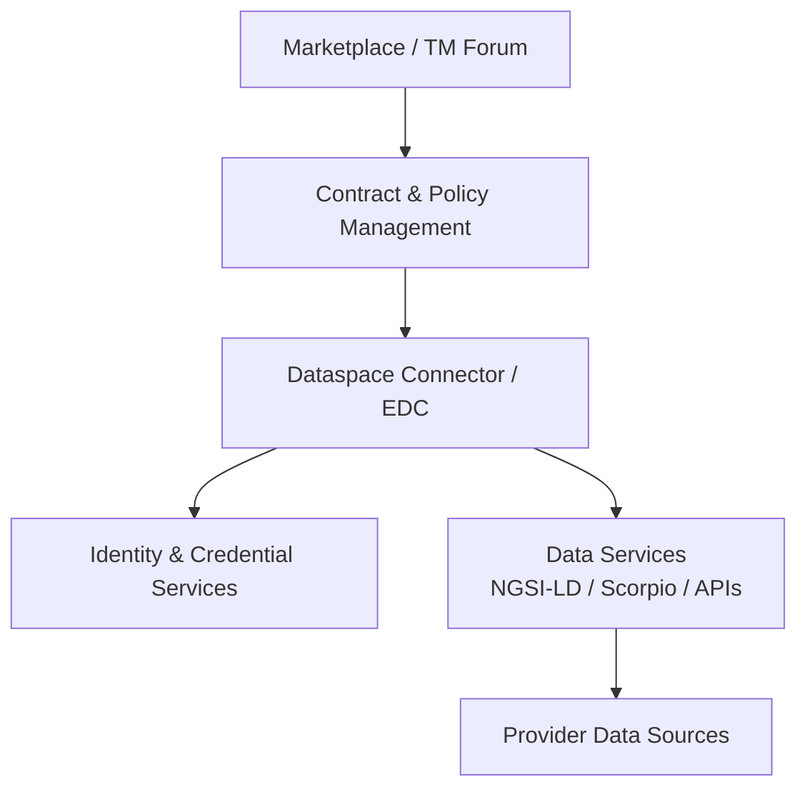
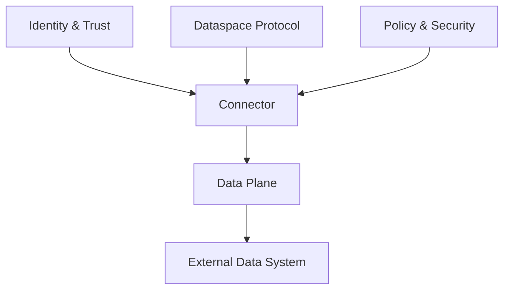
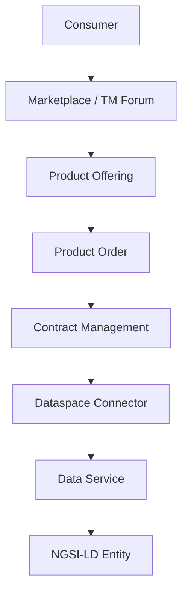
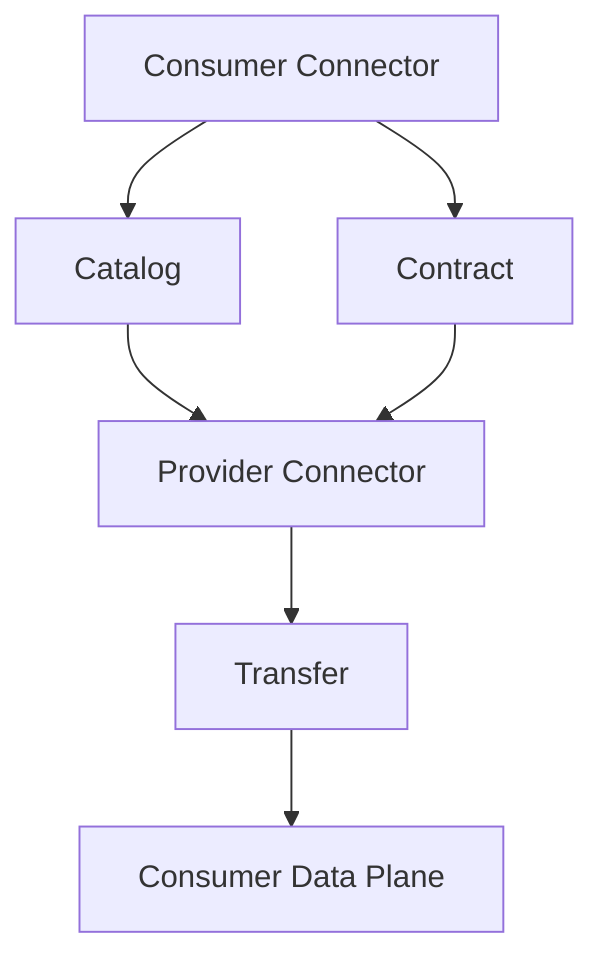
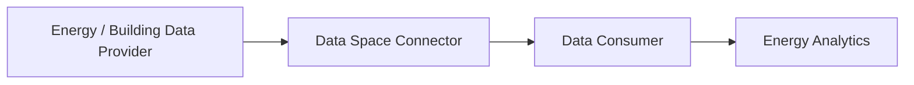

# FIWARE Data Space Connector vs TNO Trusted Secure Gateway

> **Group:** A – Data Exchange & Connector  
> **Technology:** FIWARE Data Space Connector (DSC) / TNO Trusted Secure Gateway (TSG)  
> **Research Focus:** Comparative Analysis of Data Space Connector Architectures, Secure Data Exchange, and Data Governance Mechanisms

---
# 1. Introduction

## 1.1 Background

Data Space Connectors provide the technical foundation for organizations to participate in sovereign data-sharing environments. A connector typically sits between an organization's internal data systems and external data-space participants.

Typical connector responsibilities include:

- Identity and trust management
- Authentication and authorization
- Metadata and catalog management
- Contract negotiation
- Policy enforcement
- Secure data transfer

Different connector implementations emphasize different aspects of the data-space architecture.

The **FIWARE Data Space Connector (DSC)** is designed as an engineering-oriented data-space platform that integrates multiple technologies and ecosystem components, including FIWARE technologies, Eclipse Dataspace Connector (EDC), NGSI-LD, decentralized identity mechanisms, TM Forum APIs, ODRL-based policies, and marketplace-related services.

The **TNO Trusted Secure Gateway (TSG)** is a connector implementation developed by TNO that focuses more directly on secure and interoperable data-space communication. Its architecture is more modular and emphasizes data-space protocols, identity, policy enforcement, and secure data exchange.

## 1.2 Purpose of Comparison

This comparison evaluates FIWARE DSC and TNO TSG from the following perspectives:

- Architecture and component organization
- Data exchange and communication workflow
- Contract and policy mechanisms
- Identity and trust mechanisms
- Deployment complexity
- Strengths and limitations
- Suitability for an energy data-space scenario
- Suitability for teaching and demonstration

The comparison focuses on whether each solution is more appropriate for **end-to-end data-space deployment** or for **understanding connector and data-space protocol concepts**.

---

# 2. At a Glance

The main architectural difference can be summarized as follows:

> **FIWARE DSC provides a broader data-space ecosystem, while TNO TSG focuses more directly on the connector and protocol layer.**

| Dimension | FIWARE Data Space Connector | TNO Trusted Secure Gateway |
|---|---|---|
| Primary focus | Data-space ecosystem and integration | Connector and data-space communication |
| Connector architecture | EDC/FDSC-based components | TNO TSG connector |
| Marketplace | Strong integration | Limited / outside core connector |
| NGSI-LD | Strong | Limited |
| Digital twins / IoT | Strong | Not the primary focus |
| Dataspace Protocol | Supported | Strong focus |
| Contract management | Dataspace contracts + marketplace concepts | Protocol-oriented contracts |
| Policy | ODRL / OPA-oriented | Policy-aware security mechanisms |
| Identity | DID / VC / VP-oriented | Identity and trust within connector |
| Product ordering | TM Forum ProductOrder | Not primarily marketplace-oriented |
| Deployment scope | Broad integrated environment | More modular connector deployment |
| Deployment complexity | Higher | Lower / more modular |
| Enterprise demonstration | Strong | Strong |
| Protocol learning | Good | Very strong |
| Connector research | Good | Very strong |
| Building energy / IoT scenario | Strong | Suitable |

This table provides a high-level architectural comparison. It should not be interpreted as a performance benchmark.

---

# 3. Technology Overview

## 3.1 FIWARE Data Space Connector

### Architecture Overview

FIWARE DSC can be understood as a relatively comprehensive data-space platform rather than a single lightweight connector component.

Its architecture integrates multiple functional layers:




The FIWARE environment therefore covers both **data-space connectivity** and surrounding business and infrastructure services.

### Main Characteristics

Key characteristics include:

-  Integration with FIWARE technologies and NGSI-LD 
-  Integration with Eclipse Dataspace Connector technologies 
-  Support for decentralized identity and verifiable credentials 
-  Integration with TM Forum APIs for product catalog and ordering 
-  Policy management and enforcement using technologies such as ODRL and OPA 
-  Marketplace-oriented functionality 
-  Support for IoT and digital-twin scenarios 
-  Kubernetes-based deployment for an integrated environment 

These capabilities make FIWARE DSC particularly suitable for demonstrating how data-space connectivity can be integrated with business processes, marketplaces, and IoT-oriented data services.

---

## 3.2 TNO Trusted Secure Gateway

### Architecture Overview

TNO TSG focuses more directly on the connector and secure data-space communication layer.

A simplified conceptual architecture is:



The architecture emphasizes a clear separation between connector functions and surrounding business or application services.

### Main Characteristics

Important characteristics include:

-  Strong focus on secure data-space communication 
-  Modular connector architecture 
-  Separation of control-plane and data-plane functions 
-  Identity and trust mechanisms 
-  Policy-aware data exchange 
-  Support for Dataspace Protocol concepts 
-  Less emphasis on marketplace and product-management functionality 

TSG is therefore particularly useful when the objective is to study the **technical and protocol-level behavior of a data-space connector**.

---

# 4. Architecture Comparison

## 4.1 System Design

The main architectural difference lies in the scope of each platform.

### FIWARE DSC

```
Business / Marketplace
        ↓
Contract / Policy
        ↓
Dataspace Connector
        ↓
Identity / Trust
        ↓
Data Services
        ↓
Data Sources
```

FIWARE DSC extends beyond the connector itself and integrates business, marketplace, identity, policy, and data-service components.

### TNO TSG

```
Identity / Trust
        ↓
Dataspace Protocol
        ↓
Connector
        ↓
Data Plane
        ↓
External Data System
```

TNO TSG concentrates more strongly on the connector, protocol, security, and data-exchange layers.

The conceptual distinction can therefore be summarized as:

```
FIWARE DSC
= Broader Data Space Ecosystem

TNO TSG
= Connector + Protocol + Secure Data Exchange
```

## 4.2 Component Structure

|Component / Function|FIWARE DSC|TNO TSG|
|---|---|---|
|Connector|EDC/FDSC-based components|TNO TSG connector|
|Identity|DID / VC / VP-oriented mechanisms|Identity and trust mechanisms|
|Catalog|Dataspace catalog + marketplace catalog|Dataspace Protocol catalog|
|Contract|Dataspace contracts + marketplace concepts|Dataspace Protocol contract concepts|
|Ordering|TM Forum ProductOrder|Not primarily marketplace-oriented|
|Policy|ODRL / OPA-oriented mechanisms|Policy and security enforcement|
|Data layer|NGSI-LD / Scorpio / APIs|HTTP and other data-plane mechanisms|
|Marketplace|Integrated ecosystem components|Outside the core connector|
|Deployment|Integrated Kubernetes environment|More modular deployment|
The major architectural difference is therefore the **scope of responsibility**.

FIWARE DSC provides a broader collection of services for building an integrated data-space environment, whereas TNO TSG concentrates more directly on connector-level data-space functionality.

---
## 4.3 Communication Model

FIWARE DSC may involve several communication layers:



This allows a demonstration to connect business-level product operations with subsequent technical data exchange.

TNO TSG places greater emphasis on the data-space communication itself:



Consequently, TSG provides a relatively direct way to demonstrate the core concepts of:

-  Catalog discovery 
-  Contract negotiation 
-  Policy evaluation 
-  Identity and trust 
-  Data transfer 

---
# 5. Functional Comparison

## 5.1 Data Exchange Workflow

### FIWARE DSC

A typical FIWARE-oriented workflow can include:

```
1. Provider creates data
        ↓
2. Provider creates Product Specification
        ↓
3. Provider creates Product Offering
        ↓
4. Consumer discovers Product Offering
        ↓
5. Consumer creates ProductOrder
        ↓
6. ProductOrder is processed
        ↓
7. Contract Management processes the event
        ↓
8. Authorization is established
        ↓
9. Consumer accesses protected data
```

This workflow demonstrates both:

-  Business-level interaction 
-  Technical data-space exchange 

For example, a Building Energy scenario can represent energy readings as NGSI-LD entities and expose them through a protected data service.

### TNO TSG

TSG focuses more directly on:

```
1. Establish identity
        ↓
2. Discover data
        ↓
3. Establish contract
        ↓
4. Apply policy
        ↓
5. Transfer data
        ↓
6. Enforce usage restrictions
```

The workflow is therefore closer to the conceptual structure of a data-space protocol.

## 5.2 Contract Negotiation

FIWARE DSC can combine technical contract mechanisms with marketplace and product-management concepts:

```
Product Specification
        ↓
Product Offering
        ↓
ProductOrder
        ↓
Contract Management
        ↓
Dataspace Contract
```

This makes the platform suitable for demonstrating how a data-space can connect **business transactions with technical contracts**.

TNO TSG places greater emphasis on the data-space contract itself rather than marketplace-oriented product ordering.

Therefore:

> **FIWARE DSC provides a stronger business-to-technical workflow, while TNO TSG provides a more direct protocol-oriented contract workflow.**

---

## 5.3 Policy Enforcement

FIWARE DSC can use policy technologies such as ODRL and OPA to express and enforce access and usage policies.

A simplified conceptual flow is:
```
ODRL Policy
     ↓
Policy Decision
     ↓
Authorization
     ↓
Data Access
```

This is particularly relevant for demonstrating data sovereignty.

TNO TSG also incorporates policy and security mechanisms, with policy enforcement more closely associated with connector-level secure data exchange.

The architectural distinction can therefore be illustrated as:
```
FIWARE DSC

Business Agreement
        ↓
Policy
        ↓
Authorization
        ↓
Data Access
```

versus:

```
TNO TSG

Protocol Interaction
        ↓
Policy Evaluation
        ↓
Secure Transfer
```

## 5.4 Identity and Trust

FIWARE DSC emphasizes decentralized identity technologies, including DID and Verifiable Credentials.

A simplified flow is:
```
Issuer
   ↓
Verifiable Credential
   ↓
Consumer / Provider
   ↓
Credential Verification
   ↓
Authorized Dataspace Access
```

TNO TSG incorporates identity and trust mechanisms within its connector architecture.

The important distinction is therefore architectural rather than a simple comparison of individual technologies:

- FIWARE integrates identity with marketplace, authorization, and data-space components.
- TNO TSG treats identity, trust, and secure communication as core connector concerns.

# 6. Deployment Comparison

## 6.1 Deployment Approach

FIWARE DSC is typically deployed as a relatively integrated environment.

A local demonstration may involve:
```
Kubernetes / k3s
    |
    +-- Marketplace
    +-- TM Forum APIs
    +-- Contract Management
    +-- Identity Services
    +-- Policy Services
    +-- Dataspace Connector
    +-- Scorpio
    +-- Data Services
```

This provides a realistic integrated environment but also introduces deployment complexity.

TNO TSG can be deployed in a more modular way, allowing connector functionality to be isolated from surrounding business and application services.

## 6.2 Infrastructure Requirements

### FIWARE DSC

**Advantages**
-  Multiple components can be integrated into a single environment. 
-  Suitable for end-to-end integration testing. 
-  Suitable for demonstrating multiple data-space technologies together. 

**Challenges**
-  Relatively high resource requirements. 
-  Kubernetes configuration can be complex. 
-  Multiple services must be configured and understood. 
-  Troubleshooting may involve several independent components. 

### TNO TSG

**Advantages**
-  Smaller conceptual footprint. 
-  Easier to isolate connector functionality. 
-  Suitable for protocol-level experiments. 

**Challenges**
-  Additional services may need to be configured separately. 
-  Provides less marketplace functionality as part of the core connector environment. 

---
## 6.3 Deployment Complexity

A qualitative comparison is:

```
Deployment Complexity

FIWARE DSC
████████████████████
Higher

TNO TSG
██████████
Lower / More Modular
```

This is an architectural assessment rather than a quantitative deployment benchmark. Actual resource requirements depend on the selected deployment configuration and enabled services.

# 7. Strengths and Limitations

## 7.1 FIWARE Data Space Connector

### Strengths

1. **Comprehensive ecosystem**

   FIWARE DSC combines identity, authorization, policy, marketplace, contract management, dataspace connectivity, and data services.
2. **Strong NGSI-LD integration**

   This makes it particularly suitable for IoT, smart-city, energy, and digital-twin scenarios.
3. **Business workflow integration**

   TM Forum APIs allow concepts such as Product Specification, Product Offering, and ProductOrder to be demonstrated.
4. **End-to-end demonstration value**

   A complete workflow can show how data-space technologies interact with business processes and data services.

### Limitations

1. **Higher complexity**

   There are many components to understand and configure.
2. **Larger deployment footprint**

   A complete local deployment can require substantial computing resources.
3. **Higher abstraction level**

   Some underlying data-space concepts may be hidden behind higher-level marketplace and platform components.
4. **Steeper learning curve**

   Users may need to understand Kubernetes, identity, policy, marketplace APIs, NGSI-LD, and dataspace components simultaneously.

---

## 7.2 TNO Trusted Secure Gateway

### Strengths

1. **Clear connector architecture**

   Its architecture makes the role of a connector easier to isolate.
2. **Protocol-oriented design**

   It is useful for understanding catalog, contract, transfer, identity, and policy concepts.
3. **Modularity**

   Connector functionality and surrounding services can be separated.
4. **Research value**

   Researchers can focus on secure data-space communication without necessarily deploying a complete marketplace platform.

### Limitations

1. **Less marketplace functionality**

   Compared with FIWARE DSC, TSG is less focused on TM Forum-style product management and marketplace workflows.
2. **Less emphasis on NGSI-LD**

   It is not primarily designed around FIWARE's NGSI-LD digital-twin ecosystem.
3. **Additional integration may be required**

   A complete business-oriented data-space environment may require additional external components.

---
# 8. Building Energy Data Space Scenario

## 8.1 Scenario Overview

A simplified Building Energy Data Space can be represented as:



The connector provides the governance layer between the provider and consumer.

A typical exchange workflow is:

```
Data Provider
      ↓
Publish Data Offering
      ↓
Metadata Discovery
      ↓
Contract Negotiation
      ↓
Policy Verification
      ↓
Governed Data Transfer
      ↓
Data Consumer
```

## 8.2 FIWARE DSC for Building Energy Data

FIWARE DSC is particularly suitable for this scenario because energy data can naturally be represented using NGSI-LD.

An example data entity could be:

```json
{
  "id": "urn:ngsi-ld:BuildingEnergyReading:demo",
  "type": "BuildingEnergyReading",
  "buildingId": "building-demo",
  "meterId": "meter-demo",
  "energyKWh": 128.4,
  "unit": "kWh"
}
```

The conceptual architecture is:

```
Building Energy Data
        ↓
NGSI-LD / Scorpio
        ↓
Data Service
        ↓
Dataspace Authorization
        ↓
Consumer
```

The marketplace layer can additionally represent the data product:

```
Energy Dataset
      ↓
Product Specification
      ↓
Product Offering
      ↓
ProductOrder
```

This allows the demonstration to connect the physical energy-data scenario with both business-level and technical data-space processes.

## 8.3 TNO TSG for Building Energy Data

TNO TSG is particularly suitable when the main research question is:

> How can an energy provider securely exchange data with an authorized consumer through a data-space connector?

The demonstration can focus on:
```
Provider
   ↓
Identity
   ↓
Catalog
   ↓
Contract
   ↓
Policy
   ↓
Secure Transfer
   ↓
Consumer
```

This makes TSG particularly relevant for:
- Data-space protocol education
- Connector architecture research
- Security experiments
- Policy enforcement research
- Secure data exchange demonstrations

## 8.4 Scenario-Based Evaluation

| Requirement                      | FIWARE DSC  | TNO TSG     |
| -------------------------------- | ----------- | ----------- |
| Energy data exchange             | High        | High        |
| NGSI-LD / digital twins          | High        | Limited     |
| IoT-oriented scenarios           | High        | Medium      |
| Marketplace workflow             | High        | Limited     |
| Product ordering                 | High        | Limited     |
| Dataspace protocol learning      | Medium-High | High        |
| Connector architecture research  | High        | High        |
| Policy research                  | High        | High        |
| Identity research                | High        | High        |
| Deployment simplicity            | Low-Medium  | Medium-High |
| Teaching core connector concepts | Medium      | High        |
| Enterprise-style demonstration   | High        | Medium-High |

# 9. Conclusion

FIWARE Data Space Connector and TNO Trusted Secure Gateway address different scopes within data-space technology.

FIWARE DSC is better understood as a broader data-space ecosystem and integration platform. It combines dataspace connectivity with identity, authorization, policy management, marketplace functionality, product management, and NGSI-LD-based data services.

TNO TSG is closer to a connector- and protocol-oriented architecture. Its more focused scope makes it useful for studying the fundamental mechanisms of secure data-space communication.

The distinction can be summarized as:

```
FIWARE DSC
= Data Space Connectivity
+ Identity
+ Policy
+ Marketplace
+ Product Management
+ NGSI-LD
+ Enterprise Integration
```

while:

```
TNO TSG
= Connector
+ Dataspace Protocol
+ Identity / Trust
+ Policy
+ Secure Data Exchange
```

For the current Building Energy scenario, **FIWARE DSC is a strong candidate for an end-to-end demonstration** because of its integration with NGSI-LD, marketplace concepts, policy management, and data-space connectivity.

**TNO TSG is particularly valuable as a reference for studying connector architecture, data-space protocols, identity, security, and governed data exchange.**

Therefore, the two solutions should not necessarily be viewed as direct substitutes:

> **FIWARE DSC is more suitable for demonstrating how a complete data-space ecosystem can be integrated, while TNO TSG is more suitable for studying the connector and data-space protocol layer itself.**

Relevant official documentation and technical references are collected in:

```
references.md
```
